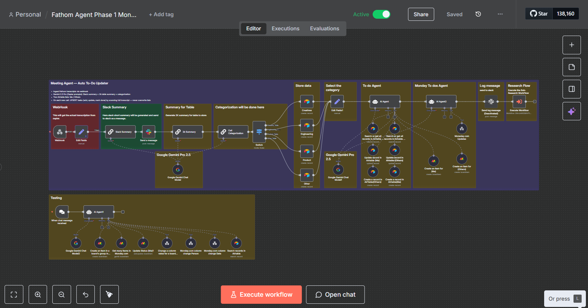
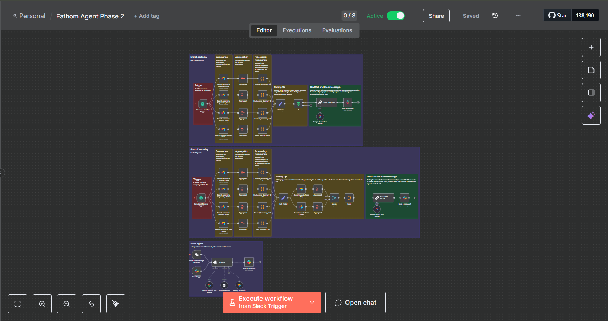
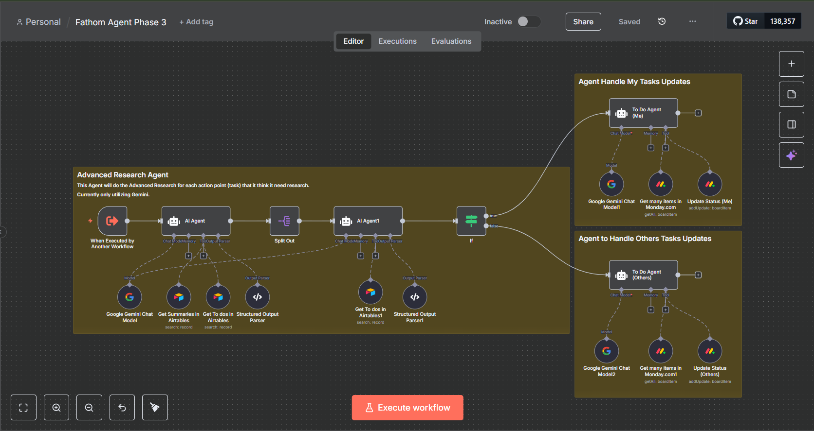
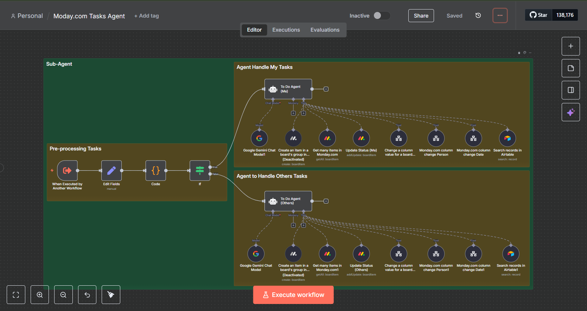

## High-Level Architecture

## Images:

### Phase 1 – Call Ingestion & Categorization

**Workflow:** `Fathom Agent Phase 1 Monday.com.json`

- Exposes an n8n **webhook** that receives:
  - Fathom transcript (`fathom transcript`)
  - Meeting title
  - Scheduled start time
  - Recording URL
- Normalizes and cleans fields in a `Set` node.
- Uses **Google Gemini (LM Chat)** to generate:
  - A detailed ~2,000-word **“2k Summary”** of each call.
  - A short, Slack-friendly **“Slack Summary”**.
- Classifies each call into one of four categories:
  - `Engineering`
  - `Product`
  - `Creatives`
  - `Other`
- Writes the call into the corresponding **Airtable** table with:
  - `Call Name`
  - `Call Link` (recording URL)
  - `Full Summary`
  - `Slack Summary`
  - `Date` (and any other relevant metadata)

**Outcome:**  
Every Fathom call becomes a structured Airtable row, pre-categorized by team and ready for aggregation and reporting.

---

### Phase 2 – Daily Executive Summaries

**Workflow:** `Fathom Agent Phase 2.json`

- Reads rows from the Airtable **“To Dos”** base across:
  - `Creatives`
  - `Engineering`
  - `Product`
  - `Other`
- Aggregates records by:
  - `Call Name`
  - `Date`
  - `Full Summary`
- Splits calls into:
  - **Today’s calls**
  - **Historical calls** (past context for the same theme/team)
- Builds a combined context for each team that includes:
  - Condensed summaries of today’s calls
  - Condensed historical call summaries
  - Relevant business context:
    - Brand and offer overview  
    - Product catalog and upcoming launches  
    - Audience and customer pain points  
    - Creative test learnings and performance insights
- Uses **Google Gemini** to produce **one executive paragraph per team** that covers:
  - Progress vs plan
  - Key decisions and owners
  - Metrics (ROAS, spend, CTR/CVR/CPA, revenue) when present
  - Blockers and risk items
  - Immediate next steps and ETA
- Sends these paragraphs as **Slack DMs** to the designated stakeholder(s) (e.g. CEO/partner).

**Outcome:**  
Leadership receives a daily, high-signal summary of what happened across all calls, without needing to open Airtable or read long transcripts.

---

### Phase 3 – Research & Guidance Agent

**Workflow:** `Fathom Agent Phase 3.json`

- Triggered by another workflow with inputs:
  - `Full call Transcript`
  - `Recording URL`
  - `Meeting Title`
  - `Table Name` (which team’s context to use)
- Enriches the prompt with **deep business context**, such as:
  - Brand and product overview
  - Org chart and key roles
  - Customer demographics and pain points
  - Creative strategy and learnings
  - Existing funnels, channels, and offers
- Uses internal tools/nodes to:
  - Fetch relevant **To-Dos** from Airtable.
  - Load **past call summaries** related to the same topic or team.
- Calls **Google Gemini** as a **research & execution agent** to:
  - Understand the primary objective from the transcript (e.g. “improve meta creative performance”, “launch new funnel”, “fix tracking”).
  - Read existing tasks and prior work so it doesn’t duplicate effort.
  - Produce a **step-by-step action plan**, including:
    - Prioritized tasks
    - Suggested owners (by role)
    - Timelines and milestones
    - Dependencies and blockers
    - References to previous calls or assets

**Outcome:**  
A single Fathom call can be turned into a concrete, context-aware playbook or SOP without manual synthesis.

---

### Monday.com Tasks Agent

**Workflow:** `Moday.com Tasks Agent.json`

- Triggered by another workflow or LLM **with a `List` payload** that describes user tasks and updates.
- Normalizes incoming task data into a standard shape:
  - `task_description`
  - `update_text`
  - `status`
  - `person_name`
- Connects to a **Monday.com board** (pre-configured board ID and group ID) and provides tools to:
  - **Create** new items from task descriptions.
  - **Update status** columns (e.g. “Working on it”, “Stuck”, “Done”).
  - **Assign people** to tasks using `person_name`.
  - **Set dates** (due dates, start dates) in date columns.
- Designed to be controlled by an LLM agent that:
  - Maps natural language user intent to specific Monday.com items.
  - Posts updates reflecting call outcomes (e.g. “Set this task to Done after today’s call”).
  - Keeps the Monday.com board in sync with decisions captured in Fathom calls.

**Outcome:**  
The system closes the loop from **“discussed on call” → “captured as structured task” → “tracked and updated in Monday.com”**, powered end-to-end by the n8n workflows and LLM agents.
